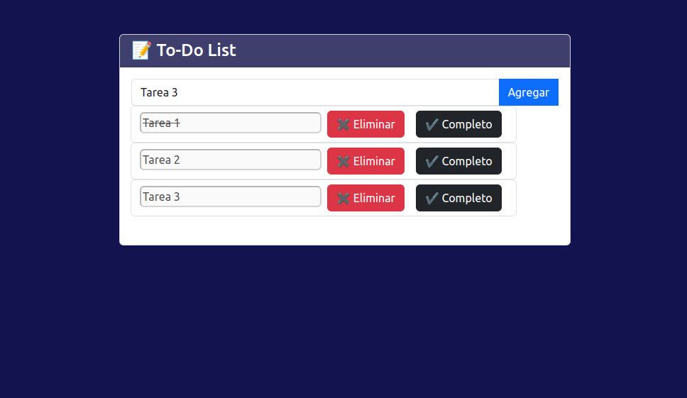

# 📝 To-Do List Web

Una aplicación web simple de lista de tareas (To-Do List) desarrollada con **HTML**, **CSS**, **Bootstrap** y **JavaScript**. Permite a los usuarios agregar, marcar como completadas y eliminar tareas fácilmente.

## 🚀 Características

- Agregar nuevas tareas.
- Marcar tareas como completadas.
- Eliminar tareas individuales.

## 📸 Vista Previa

## 🛠️ Tecnologías utilizadas

- HTML5
- CSS3
- Bootstrap 5
- JavaScript (Vanilla)
